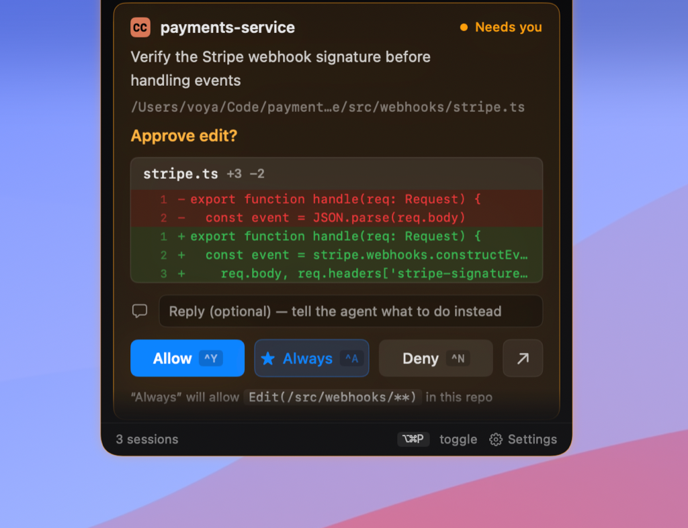

<div align="center">

# 🦖 DinoPing

**A tiny dino in your notch that pings you the moment an AI agent needs you.**

DinoPing turns the MacBook notch into a live readout of every AI coding agent
you're running — who's working, who's blocked waiting on you, and who just
finished — and lets you jump in or approve with a single keystroke, without
alt-tabbing through a dozen terminal tabs.

<!-- TODO: drop a hero screenshot / GIF here -->
<!--  -->

</div>

---

## Why

You kick off Claude Code in one tab, another in a second repo, a third in a
fullscreen Terminal on another Space. Minutes later you've lost the thread —
which one is still thinking? Which one has been blocked on a permission prompt
this whole time? DinoPing answers that from the notch, and pings you the moment
one needs a human — so you can respond without leaving what you're doing.

## Features

- **Live session monitoring** — every active agent shows up in the notch with a
  status dot (working · waiting on you · idle · done · error) and a pixel-dino
  mascot that reflects its state.
- **Accurate, fast count** — process-liveness tracking means a newly opened
  agent appears and a closed one drops within a couple of seconds, even when no
  exit hook fires.
- **Menu-bar dropdown** — per-session status at a glance; click any session to
  jump straight to its terminal tab (iTerm2, Ghostty, Terminal).
- **Respond from anywhere** — global hot-keys to approve/deny a permission
  request, jump to the agent that needs you, or toggle the panel — they work
  even from a fullscreen app.
- **Native permission rules** — "Always allow" writes a rule into the agent's
  own config, so it auto-approves next time before the prompt ever fires.
- **Settings** — launch at login, notification sounds, which display the notch
  lives on, and fully rebindable shortcuts.

## Hot-keys

| Shortcut | Action |
|----------|--------|
| `⌥⌘P` | Toggle the notch panel |
| `⌥⌘J` | Jump to the terminal of the next session needing you |
| `⌥⌘↩` | Approve the front pending permission |
| `⌥⌘⌫` | Deny the front pending permission |

All four are rebindable in **Settings → Shortcuts**.

## Requirements

- macOS 14 (Sonoma) or later
- [Claude Code](https://docs.claude.com/claude-code) — the agent DinoPing is
  built around today (more agents planned)
- For jump-to-tab: iTerm2, Ghostty, or the built-in Terminal

## Install

> Not yet notarized or shipped as a signed `.app` — for now, build from source.
> A packaged build with one-click updates is on the roadmap.

```sh
git clone https://github.com/OWNER/DinoPing.git
cd DinoPing
swift build -c release
swift run -c release AgentPulse
```

On first launch DinoPing installs its Claude Code hooks and asks for the
permissions it needs (Automation, to focus terminal tabs).

## How it works

DinoPing runs a tiny local HTTP server and registers Claude Code hooks that
report session lifecycle and permission events to it. It pairs each hook session
with its OS process (via the transcript file and a `ps` snapshot) so the notch
reflects real process liveness, not just the last event it happened to see.
Nothing leaves your machine.

## Roadmap

- Signed + notarized `.app` bundle
- Built-in update checking via GitHub Releases (the checker already ships;
  it lights up once releases are published)
- System notifications when an agent needs you
- More agents (Codex, Gemini) and more terminals

## License

Proprietary — see [LICENSE](LICENSE). © 2026 voya. All rights reserved.
